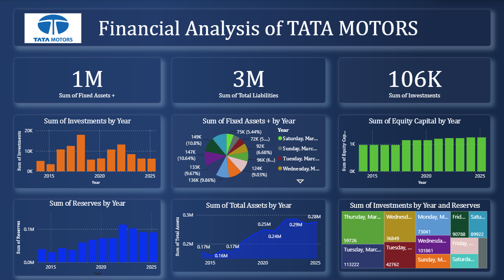

## 📊 Project Overview

This project presents a financial analysis dashboard of Tata Motors created using Microsoft Power BI.

The dashboard provides an interactive view of financial data through charts, KPIs, and visual analysis.

## 🛠️ Tools Used

- Microsoft Power BI
- Data Analysis
- Data Visualization

## 📌 Key Features

- Interactive financial dashboard
- KPI-based analysis
- Data visualization
- Financial performance insights

## 📷 Dashboard Preview

## 📁 Project File

The Power BI dashboard file is included in this repository as a `.pbix` file.

## 👩‍💻 Author

**Palak Gupta**

B.Tech Computer Science & Engineering  
Lovely Professional University
